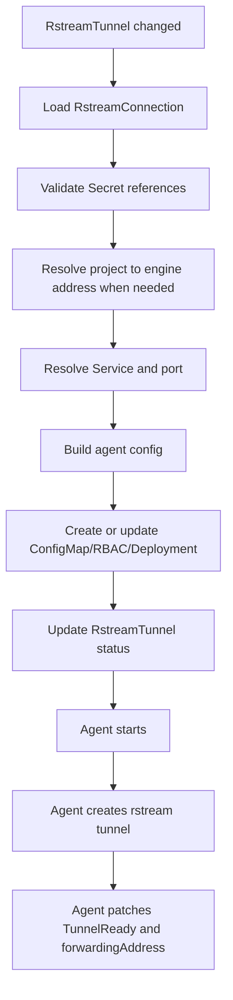

# Architecture

The operator separates Kubernetes reconciliation from tunnel forwarding.

## Components

### Manager

The manager runs controller-runtime controllers for:

- `RstreamConnection`
- `RstreamTunnel`

It validates references, resolves hosted projects through the Control plane when needed, creates managed Kubernetes resources, and maintains status conditions.

### Agent

The agent is a separate binary in the same image. Each `RstreamTunnel` gets one agent Deployment. The agent:

- reads non-secret config from a ConfigMap;
- reads credentials from mounted Secrets or environment variables;
- connects outbound to the rstream engine;
- creates the rstream tunnel;
- forwards traffic to the target Service;
- patches `RstreamTunnel.status`.

## Managed Resources

For a `RstreamTunnel` named `web`, the controller creates deterministic child resources:

- `ConfigMap`: agent configuration;
- `ServiceAccount`: agent identity;
- `Role`: access only to this RstreamTunnel and its status;
- `RoleBinding`: binds the agent ServiceAccount;
- `Deployment`: single agent Pod.

The resources have owner references pointing to the `RstreamTunnel`.

## Reconciliation Flow

## Status Ownership

The manager owns:

- `Accepted`
- `Resolved`
- `AgentReady`
- the initial aggregate `Ready` state.

The agent owns:

- `TunnelReady`
- `tunnelID`
- `forwardingAddress`
- runtime tunnel errors.

Both may update `Ready`; the manager keeps it false while Kubernetes resources are not ready, and the agent marks it true once the rstream tunnel is online.

## Failure Behavior

If the engine disconnects, the agent marks `TunnelReady=False`, clears readiness, and retries with exponential backoff.

If a Secret, Service, or Service port is missing, the manager keeps the agent resources from being updated and sets `Ready=False` with an actionable reason.

If a `RstreamTunnel` is deleted, the finalizer deletes managed children before removing itself.
